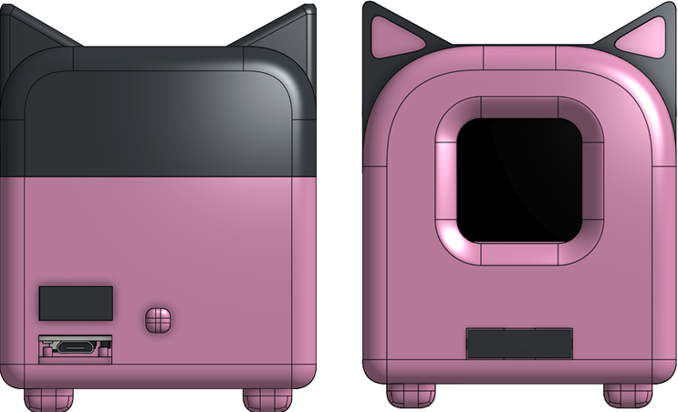
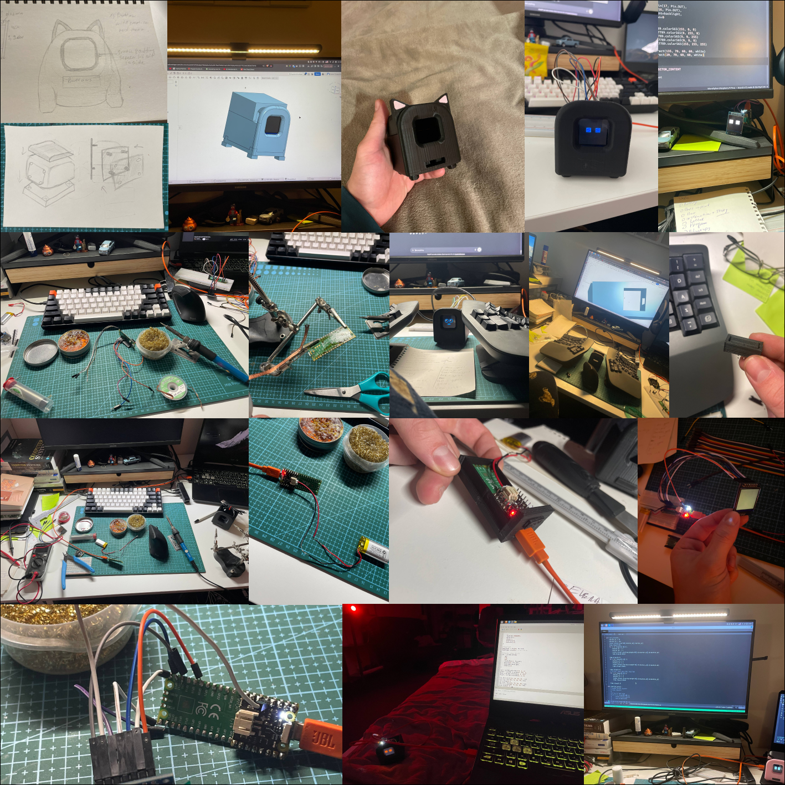

# Arch Mini

Cute robot project made completelly from scratch with love to engineering and programming, using python for embedded development, creating custom CAD model for 3d printing.



## Hardware components
1. Raspberry pi pico 2
2. SPI 240x240px display (ST7789 driver)
3. 900mAh LiPol battery 
4. PiMoroni LiPo SHIM power boost

## Connection pins
Display:
1. VCC - 3.3V
2. SCK - GP14
3. SDA (MOSI) - GP15
4. RES - GP17
5. DC - GP16
6. BLK - GP9
7. GND - GND

Action button:
1. Signal - GP19
2. GND - GND

## Features

- Robot emotions are depending on hunger, tiredness and button inteructions
- Modular project structure
- Python-based robot control logic
- Easy deployment with shell scripts

## Project structure

```bash
.
├── lib/            # Core robot libraries and modules
├── main.py         # Main application entry point
├── test.py         # Testing and experimentation script
├── deploy.sh       # Deployment script
```

## Project history


